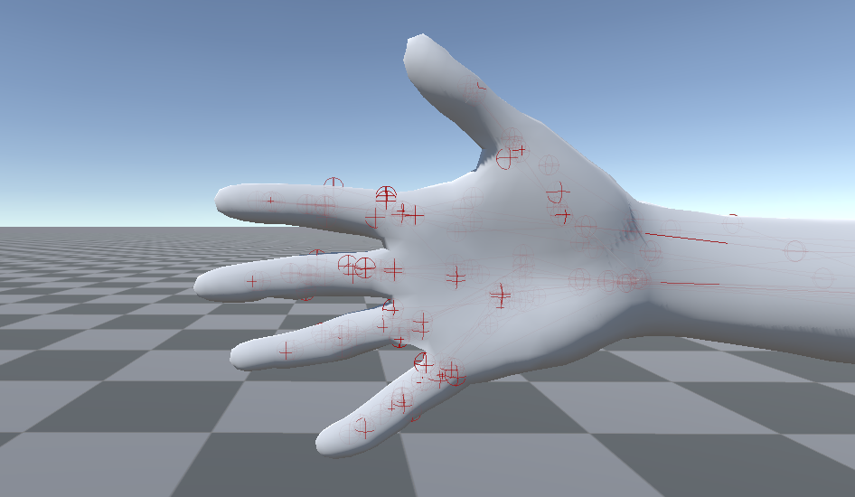
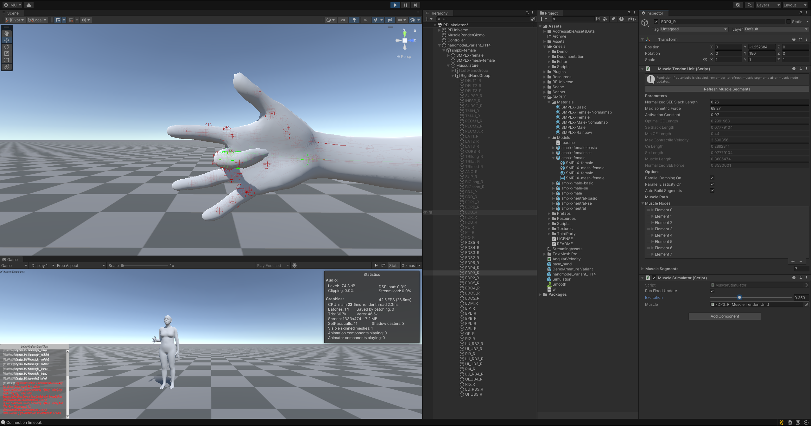

# MS-MANO Simulator 

MS-MANO simulator is the Unity program described in the CVPR'24 paper [MS-MANO: Enabling Hand Pose Tracking with Biomechanical Constraints](https://ms-mano.robotflow.ai/). 

For other components of the MS-MANO project, please refer to the [project page of MS-MANO](https://ms-mano.robotflow.ai/).


The simulator is built upon [RFUniverse](https://github.com/mvig-robotflow/rfuniverse), [Kinesis](https://assetstore.unity.com/packages/tools/physics/kinesis-physical-muscle-model-based-movement-206089) and [SMPL-X](https://smpl-x.is.tue.mpg.de/) body model. As Kinesis is a paid asset, we provide two ways for you to run the simulator:
1. Purchase Kinesis from Unity Asset Store and import it to the project (you can modify the code in this way), or
2. Use the pre-built binary in the [releases](https://github.com/panoanx/ms-mano-unity/releases),

We will provide the detailed instructions for both ways in the following sections.


## Installation

###  Use Kinesis and the Source Code

#### Operating System
The unity project is tested on both Linux and Windows.

#### Install Unity Hub and Unity Editor
You have to first make sure you have [Unity Hub](https://unity3d.com/get-unity/download) installed and login to the unity hub with the account you used to purchase Kinesis. 

Then, install the Unity version `2022.3.x` (`x` indicates any version, e.g. `2022.3.5f1`) through `sidebar - installs - install editor`. 

#### Clone the Repository and Open the Project
Clone the repository to your local machine by running the following command:
```sh
# through ssh
git clone git@github.com:panoanx/ms-mano-unity.git
# or through https
# git clone https://github.com/panoanx/ms-mano-unity.git 
```
Assume the path to the cloned repository is `path/to/ms-mano-unity`. Open Unity Hub, click `Add` and select the `path/to/ms-mano-unity` to add the project to Unity Hub.

Then, click the project to open it in Unity Editor.

After the project is opened, open the scene `Assets/Scene/PD-skeleton` in the project window in the `Project` tab.

> [!NOTE]
> The project is developed with version `2022.3.5f1`, so you may have to mannually upgrade the project version as previous versions are no longer offered through Unity Hub. Versions start with `2022.3` are compatible with the project. 

> [!TIP] 
> You may notice errors, warnings or missing scripts when opening the project. It's common during upgrades and migrations. Ignore them all and continue to the next step.

#### Import Kinesis and Apply Patch

To import the kinesis package, open the package manager in the `Window` tab, click `Package Manager`. 
To display the assets you have purchased, select `My Assets` in the dropdown menu on the top left, next to the '+'. Find Kinesis in the list and click `Download` to download the package. After the download is finished, click `Import` to import the package to the project. 

You shall see the `Kinesis` folder in `path/to/ms-mano-unity/Assets/Kinesis`
```sh
tree -L 1 -I '*.meta' path/to/ms-mano-unity/Assets/Kinesis
# path/to/ms-mano-unity/Assets/Kinesis
# ├── Demo
# ├── Documentation
# ├── Editor
# └── Scripts
#
# 5 directories, 0 files
```

To retrieve the muscle-related features from kinesis, we modified the `Kinesis` package. You can find the patch file in `path/to/ms-mano-unity/kinesis.patch`. 
Apply the patch by running the following command:
```sh
cd path/to/ms-mano-unity # go to the project root
patch -p0 < kinesis.patch
# patching file Assets/Kinesis/Demo/Scripts/Components/CameraController.cs
# patching file Assets/Kinesis/Demo/Scripts/Components/JointPID.cs
# patching file Assets/Kinesis/Demo/Scripts/Components/JointPID.cs.meta
# patching file Assets/Kinesis/Demo/Scripts/Components/MuscleSimulation.cs
# patching file Assets/Kinesis/Scripts/Components/MuscleGroup.cs
# patching file Assets/Kinesis/Scripts/Components/MuscleStimulator.cs
# patching file Assets/Kinesis/Scripts/Core/MuscleTendonUnit.cs
# patching file Assets/Kinesis/Scripts/Library/SingletonMonoBehaviour.cs
```

After the patch is applied, you can switch back to Unity Editor. You shall see muscle nodes and lines in the smplx human's right hand.



> [!NOTE]
> You can test the muscles to ensure the patch is applied correctly. Open the `PD-skeleton` scene in the `Assets/Scene` folder. Click the `Play` button to run the simulation. In the `Hierarchy` tab, you can find the muscles in `handmodel_variant_1114/smplx-female/Musculature/RightHandGroup`. You can select the muscles (ignore the gray ones), for example, `FDS3_R` and in the `Inspector` tab you shall see a `Muscle Stimulator` component. You can change the `Excitation` value to see the muscle contraction. Refer to the [Kinesis Documentation](https://squeakyspacebar.github.io/kinesis-doc/) for more details.
> 

#### Run the Simulator
To run the simulator, click the `Play` button in the Unity Editor. 


### Use the Pre-built Binary
We provide the pre-built binary in the [releases](https://github.com/panoanx/ms-mano-unity/releases). You can download the binary and run it directly.

### Build the Project Yourself

You may modify the code, adjust the model or add new features. To build the project yourself, you can follow the instructions in the [Unity Documentation](https://docs.unity3d.com/Manual/BuildSettings.html).

> [!IMPORTANT]
> You will have to comment a macro before building. The macro is localed in *Assets/Kinesis/Scripts/Components/MuscleStimulator.cs* at line 1 as `#define APPLY_TORQUE`. This macro controls whether to apply the muscle-stimulator torque (the excitation slider). In builds, the editor components would not function properly, the torques would induce unexpected movements.

> [!TIP]
> If you are using WSL (Windows Subsystem for Linux), you can execute the `.exe` builds directly in the terminal. The communication is through `tcp://localhost:port` so it works across the WSL and Windows.
> This is helpful if you are setting up the environment on a WSL.